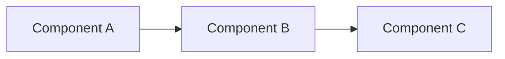

# Output Format Templates

This reference provides ready-to-use output format templates for common prompt engineering needs. Use these to ensure consistent, parseable outputs.

---

## JSON Formats

### 1. Analysis Result

```json
{
  "summary": "Brief overview of findings",
  "analysis": {
    "strengths": ["strength 1", "strength 2"],
    "weaknesses": ["weakness 1", "weakness 2"],
    "opportunities": ["opportunity 1", "opportunity 2"],
    "threats": ["threat 1", "threat 2"]
  },
  "score": 85,
  "confidence": "high",
  "recommendations": [
    {
      "priority": "high",
      "action": "Specific action to take",
      "rationale": "Why this matters",
      "effort": "low|medium|high"
    }
  ],
  "metadata": {
    "analyzed_at": "2025-12-09T10:30:00Z",
    "version": "1.0"
  }
}
```

---

### 2. Code Review Result

```json
{
  "file": "path/to/file.js",
  "overall_quality": 7.5,
  "issues": [
    {
      "id": "ISS-001",
      "severity": "critical|high|medium|low",
      "category": "security|performance|correctness|style",
      "line": 42,
      "function": "functionName",
      "issue": "Clear description of the problem",
      "current_code": "const unsafe = eval(userInput);",
      "suggested_fix": "// Don't use eval with user input\nconst safe = JSON.parse(userInput);",
      "rationale": "eval() executes arbitrary code and is a major security vulnerability",
      "references": ["https://owasp.org/..."]
    }
  ],
  "summary": {
    "total_issues": 5,
    "critical": 1,
    "high": 2,
    "medium": 1,
    "low": 1,
    "blocks_merge": true
  }
}
```

---

### 3. Test Generation Result

```json
{
  "test_suite": "UserAuthenticationTests",
  "framework": "jest",
  "tests": [
    {
      "name": "should authenticate valid user credentials",
      "type": "unit|integration|e2e",
      "priority": "high",
      "code": "test('should authenticate valid user', async () => {\n  // test code\n});",
      "covers": ["happy path", "valid credentials"],
      "dependencies": ["database", "auth service"]
    }
  ],
  "coverage": {
    "estimated_percentage": 85,
    "covered_scenarios": ["login", "logout", "token refresh"],
    "missing_scenarios": ["password reset", "2FA flow"]
  }
}
```

---

### 4. Error Analysis Result

```json
{
  "error_type": "NullPointerException",
  "severity": "high",
  "root_cause": {
    "file": "UserService.java",
    "line": 156,
    "function": "getUserProfile",
    "explanation": "User object is null when optional findById returns empty"
  },
  "stack_trace_analysis": [
    {
      "frame": "UserService.getUserProfile:156",
      "significance": "high",
      "explanation": "This is where the null dereference occurs"
    }
  ],
  "recommended_fix": {
    "approach": "Add null check before accessing user object",
    "code": "Optional<User> userOpt = repository.findById(id);\nif (!userOpt.isPresent()) {\n  throw new UserNotFoundException(id);\n}\nUser user = userOpt.get();",
    "prevents_recurrence": true
  },
  "testing_strategy": [
    "Add test case for non-existent user ID",
    "Verify exception is thrown with correct message"
  ]
}
```

---

## Markdown Formats

### 1. Technical Documentation

```markdown
# Component Name

## Overview
Brief description of what this component does and why it exists.

## API Reference

### `functionName(param1, param2)`

**Description:** What the function does

**Parameters:**
- `param1` (type): Description
- `param2` (type): Description

**Returns:** Return type and description

**Example:**
```language
// Usage example
const result = functionName('value1', 'value2');
```

**Errors:**
- `ErrorType1`: When this happens
- `ErrorType2`: When this happens

---

## Architecture



## Configuration

| Option | Type | Default | Description |
|--------|------|---------|-------------|
| `option1` | string | `"default"` | What this controls |
| `option2` | number | `100` | What this controls |

## Examples

### Example 1: Basic Usage
[Detailed example]

### Example 2: Advanced Usage
[Detailed example]

## Best Practices

✅ Do this
✅ Do that
❌ Don't do this
❌ Don't do that

## Troubleshooting

**Problem:** Description of issue
**Solution:** How to fix it

## References

- [Related Doc 1](url)
- [Related Doc 2](url)
```

---

### 2. Implementation Plan

```markdown
# Implementation Plan: [Feature Name]

## Objective
Clear statement of what we're building and why.

## Requirements

### Functional
- [ ] Requirement 1
- [ ] Requirement 2
- [ ] Requirement 3

### Non-Functional
- [ ] Performance: Response time < 200ms
- [ ] Security: All inputs validated
- [ ] Scalability: Handles 10K concurrent users

---

## Architecture

### Components
1. **Component A**: Responsible for X
2. **Component B**: Responsible for Y
3. **Component C**: Responsible for Z

### Data Flow
1. User action triggers...
2. System processes...
3. Result is returned...

---

## Implementation Steps

### Phase 1: Foundation (Priority: High)

**Task 1.1: Setup Database Schema**
- Create users table
- Create sessions table
- Add indexes for performance
- Estimated effort: 2 hours

**Task 1.2: Implement Auth Service**
- JWT token generation
- Password hashing with bcrypt
- Session management
- Estimated effort: 4 hours

### Phase 2: Core Features (Priority: High)

[Continue for each phase...]

---

## Testing Strategy

### Unit Tests
- [ ] Auth service token generation
- [ ] Password validation logic
- [ ] Session creation/deletion

### Integration Tests
- [ ] Login flow end-to-end
- [ ] Token refresh flow
- [ ] Logout clears session

### Edge Cases
- [ ] Invalid credentials
- [ ] Expired tokens
- [ ] Concurrent login attempts

---

## Risks & Mitigations

| Risk | Probability | Impact | Mitigation |
|------|------------|--------|------------|
| Token theft | Medium | High | Use short expiry + refresh tokens |
| Password leaks | Low | Critical | Bcrypt + rate limiting |

---

## Success Criteria

- [ ] All functional requirements met
- [ ] Test coverage > 80%
- [ ] Response time < 200ms
- [ ] Zero critical security vulnerabilities
- [ ] Documentation complete

---

## Open Questions

1. **Question:** Should we support OAuth providers?
   **Status:** Pending product decision

2. **Question:** What's our token expiry policy?
   **Status:** Pending security review
```

---

### 3. Code Review Report

```markdown
# Code Review: PR #123 - Add User Authentication

## Summary

**Author:** @developer
**Reviewer:** @reviewer
**Status:** 🟡 Needs Changes
**Overall Quality:** 7/10

---

## Critical Issues (Must Fix)

### 🔴 [CRITICAL] SQL Injection Vulnerability
**Location:** `auth.js:42`

**Issue:**
```javascript
// Current (unsafe)
const query = `SELECT * FROM users WHERE email = '${email}'`;
```

**Fix:**
```javascript
// Recommended (safe)
const query = 'SELECT * FROM users WHERE email = ?';
db.query(query, [email]);
```

**Rationale:** User input directly in SQL query enables injection attacks.

---

## High Priority Issues (Should Fix)

### 🟠 [HIGH] Missing Error Handling
**Location:** `auth.js:78`

**Issue:** No try-catch around database operations

**Recommendation:**
```javascript
try {
  const user = await db.query(...);
  return user;
} catch (error) {
  logger.error('Auth failed:', error);
  throw new AuthenticationError('Unable to authenticate');
}
```

---

## Medium Priority Issues (Nice to Fix)

### 🟡 [MEDIUM] Inconsistent Naming
**Location:** Multiple files

**Issue:** Mix of camelCase and snake_case
**Recommendation:** Standardize on camelCase per project style guide

---

## Positive Observations ✅

- Well-structured code with clear separation of concerns
- Good test coverage (85%)
- Comprehensive documentation

---

## Review Checklist

- [x] Code follows project style guide
- [ ] All edge cases handled (missing expired token check)
- [x] Tests are comprehensive
- [ ] Security vulnerabilities addressed (SQL injection found)
- [x] Documentation is clear
- [x] Performance is acceptable

---

## Verdict

**Status:** 🟡 Requesting Changes

Please address the critical SQL injection vulnerability before merge. Other issues can be addressed in follow-up PRs if time-sensitive.

**Estimated time to fix:** 1-2 hours
```

---

## Structured Text Formats

### 1. Decision Record

```
# ADR-001: Use PostgreSQL for Primary Database

## Status
ACCEPTED

## Context
We need to choose a primary database for our application. Requirements:
- Relational data model with complex queries
- ACID compliance for financial transactions
- Expected scale: 1M users, 10GB data
- Team has SQL experience

## Decision
We will use PostgreSQL as our primary database.

## Consequences

### Positive
- Strong ACID guarantees for transactions
- Excellent query optimizer for complex joins
- JSON support for semi-structured data
- Active community and ecosystem
- Team expertise reduces onboarding time

### Negative
- Horizontal scaling requires additional tools (Citus)
- More operational overhead than managed NoSQL
- Query performance tuning required for scale

### Neutral
- Need to establish backup/restore procedures
- Migration strategy needed if requirements change

## Alternatives Considered

1. **MongoDB**: Better for unstructured data, but weaker consistency
2. **MySQL**: Similar features but weaker JSON support
3. **DynamoDB**: Great scaling but expensive and team lacks experience
```

---

### 2. Incident Report

```
# Incident Report: API Outage 2025-12-09

## Summary
API experienced complete outage for 47 minutes due to database connection pool exhaustion.

## Timeline (UTC)
- 14:32: Monitoring alerts for elevated error rates
- 14:35: Investigation begins
- 14:42: Database connection pool identified as cause
- 14:55: Emergency fix deployed (increased pool size)
- 15:02: Pool exhaustion recurring
- 15:12: Root cause identified (connection leak in new code)
- 15:19: Hotfix deployed (fixed connection leak)
- 15:19: Service recovered

## Impact
- Duration: 47 minutes
- Affected: 100% of API requests
- Requests failed: ~142,000
- Users impacted: ~8,500

## Root Cause
Recent deployment introduced connection leak in user authentication endpoint.
Connections were not being returned to pool on certain error conditions.

Code:
```javascript
// BAD: Connection not released on error
async function authenticate(credentials) {
  const conn = await pool.getConnection();
  const user = await conn.query(...);
  if (!user) {
    throw new Error('Invalid credentials'); // Leak!
  }
  conn.release();
  return user;
}
```

## Resolution
Fixed connection leak with try-finally:
```javascript
async function authenticate(credentials) {
  const conn = await pool.getConnection();
  try {
    const user = await conn.query(...);
    if (!user) {
      throw new Error('Invalid credentials');
    }
    return user;
  } finally {
    conn.release(); // Always releases
  }
}
```

## Prevention
1. Add automated tests for connection pool metrics
2. Implement connection leak detection in development
3. Add load testing to CI/CD for connection-heavy endpoints
4. Document connection management patterns for team
5. Add monitoring alerts for pool utilization > 80%

## Action Items
- [ ] @dev: Add connection pool tests (#234)
- [ ] @ops: Implement leak detection (#235)
- [ ] @qa: Add load testing (#236)
- [ ] @team-lead: Connection patterns doc (#237)
- [ ] @ops: Alert for pool utilization (#238)
```

---

## Tips for Custom Formats

1. **Start with structure**: Define sections before content
2. **Use examples**: Show complete examples, not just schemas
3. **Be explicit**: Specify types, formats, required fields
4. **Handle optionals**: Clearly mark what's optional vs required
5. **Version control**: Include version field for format changes
6. **Validate**: Include validation rules in the prompt
7. **Test**: Show both valid and invalid examples
